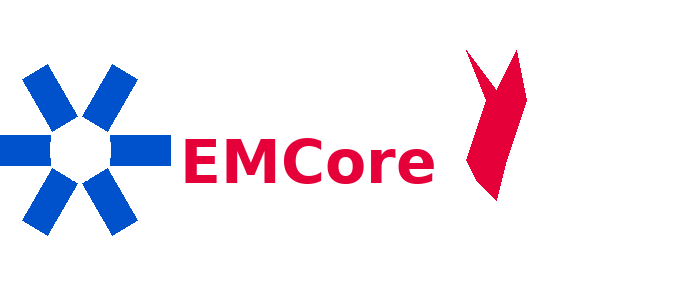

# EMCore



**EMCore** is a mobile-first, tenant-aware platform for EMS agencies and fire departments to manage their operations, inventory, personnel, and compliance in one place.

## Project Purpose

EMCore provides a unified platform for emergency services organizations to:

- Track and manage **subjects** (apparatus, stations, equipment) in a hierarchical structure
- Manage **inventory** including controlled substances, serialized assets, and supply profiles
- Conduct **checks** (vehicle checks, equipment audits) using configurable templates
- Track **maintenance** schedules and work orders for apparatus
- Manage **scheduling** with shift-based crew and unit assignments
- Maintain **personnel** records including credentials, training, and HR documents
- Track **issues** and link them to specific entities
- Maintain a full **audit log** of all changes

## Solution Layout

```
EMCore/
├── src/
│   ├── EMCore.Domain/          # Core business entities and enums
│   ├── EMCore.Application/     # Application logic and interfaces (future)
│   ├── EMCore.Infrastructure/  # EF Core DbContext and data access
│   └── EMCore.Api/             # ASP.NET Core Web API + static SPA
│       └── wwwroot/            # HTML/CSS/JS prototype
├── tests/
│   └── EMCore.Domain.Tests/    # xUnit domain entity tests
├── assets/
│   └── branding/               # Logos and brand assets
├── archive/                    # Original source zip
└── EMCore.sln
```

## How to Build

```bash
dotnet restore
dotnet build -c Release
```

## How to Run

```bash
cd src/EMCore.Api
dotnet run
```

The API will be available at `https://localhost:5001` (or `http://localhost:5000`).
Swagger UI is available at `/swagger` in Development mode.

## How to Test

```bash
dotnet test -c Release
```

## Architecture

### Tenant Isolation
Every tenant-scoped entity inherits from `TenantEntity`, which carries a `TenantId`. The `AppDbContext` applies a global query filter so queries are automatically scoped to the active tenant.

### Subject Hierarchy
`Subject` entities are self-referential, allowing stations, apparatus, and equipment to be nested. Each `Subject` has a `SubjectType` with configurable properties.

### Inventory
Supports both lot-tracked consumables and serialized assets. `InventoryProfile` defines the expected kit for a given subject (e.g., ALS ambulance drug box).

### Checks
Configurable check templates with sections and questions. Supports PassFail, YesNo, NumericCount, and Text question types. Check instances record responses and overall pass/fail.

### Maintenance
Maintenance schedules trigger work orders based on date intervals or mileage. Mileage logs track odometer readings per subject.

### Scheduling
Shifts define time windows. Schedule periods link a shift to a date. Unit and crew assignments place subjects and persons on a given shift.

### Personnel
Tracks credentials with expiration warnings, training records, and HR documents. Persons can be optionally linked to system Users.

### Issues & Audit
Issues can be linked to any entity type. All data changes are recorded in the `AuditLogEntry` table with old/new values.

## Technology Stack

- **.NET 8** — cross-platform web API framework
- **EF Core 8 with SQLite** — database ORM (SQLite for development, swappable for production)
- **xUnit** — unit testing framework
- **Static HTML/CSS/JS** — lightweight prototype SPA served from wwwroot
